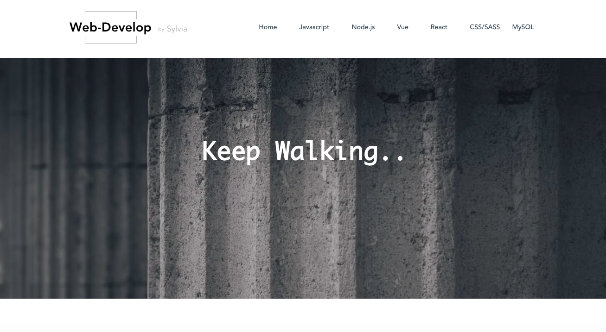
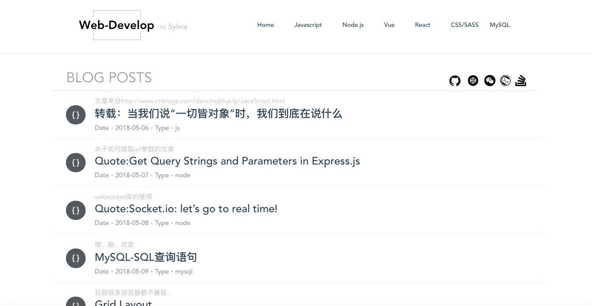
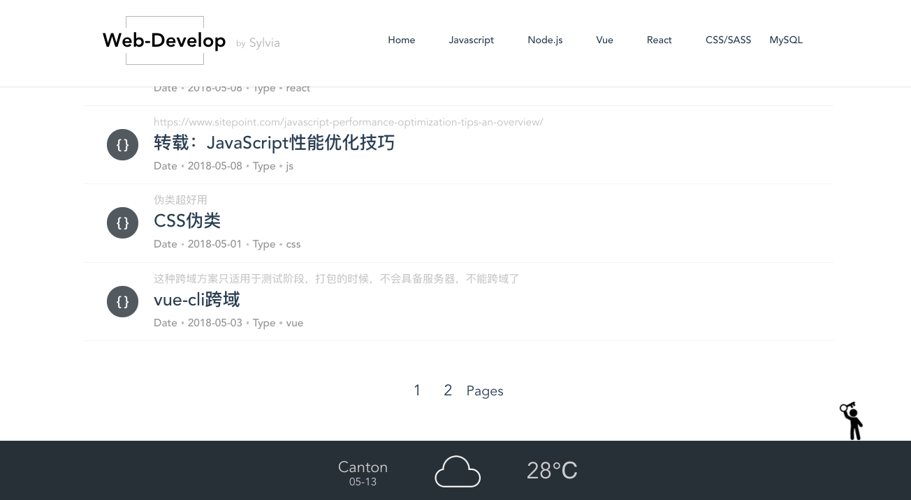
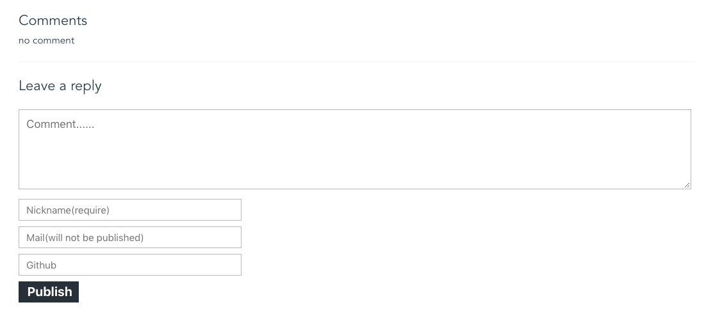
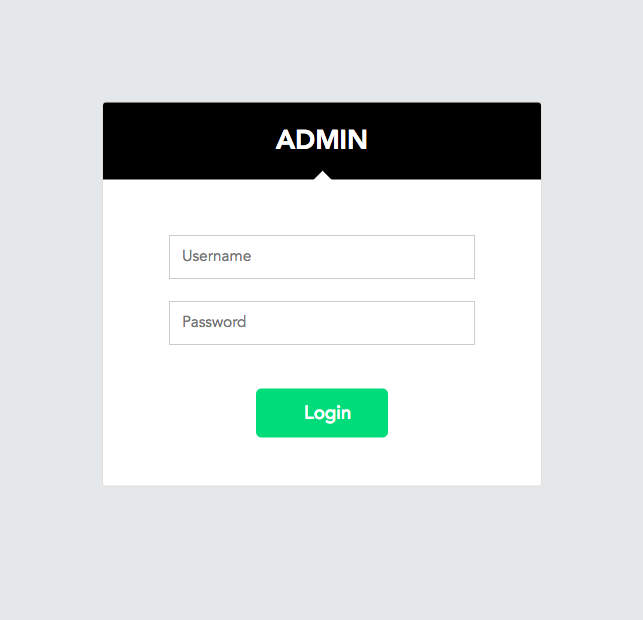
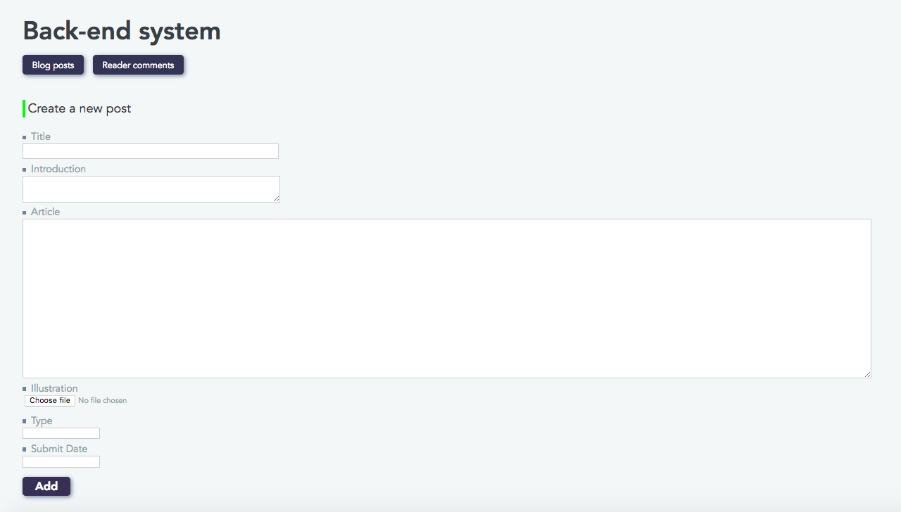
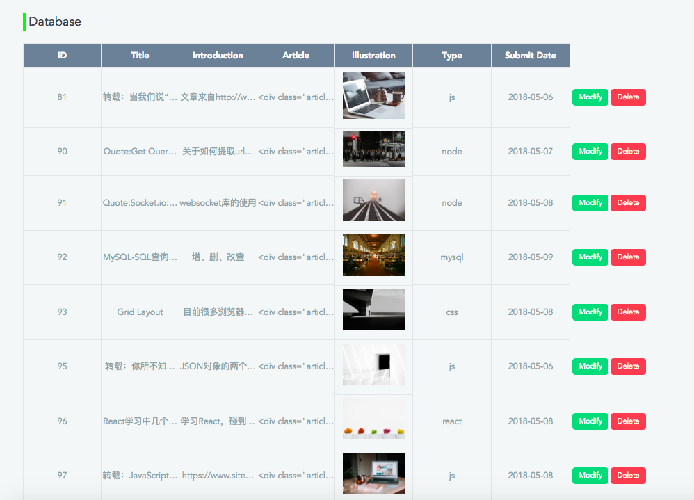
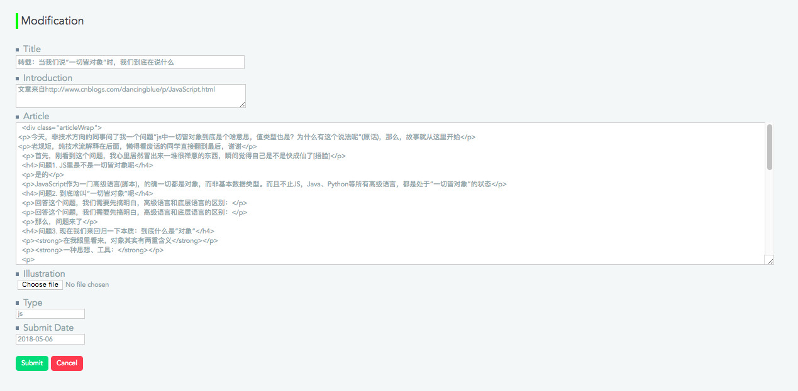

# 博客系统

基于Node.js的express框架搭建的个人博客系统，采用响应式布局保证在传统台式电脑或平板电脑上浏览都能获得最佳体验


### 技术构成

- 服务端：Node.js,基于Node.js的Express框架搭建
- 后台模版引擎Ejs
- Web框架Vue + Vue-router +Axios +Vue-cli
- 数据库MySQL
- 样式预处理器Sass


### 功能模块

##### 博客

- 文章列表
- 文章分类
- 文章详细页
- 文章分页
- 实时天气播报
- 留言评论
- codepen代码展示

##### 后台管理

- 管理员登陆
- 管理员权限管理
- 博客管理 - 新增文章
- 博客管理 - 文章管理（分类 / 修改 / 删除）
- 留言管理


### 快速开始

##### 准备条件

安装最新版Node.js，MySQL 


##### 安装依赖

- 服务端依赖 / 客户端依赖

 ```
npm install
 ```


##### 数据导入

数据库资料blog.sql


##### 开发环境

- 前台启动

```
npm run go => localhost:8080
```

- 后台启动

```
node server.js => localhost:8090
```


### 博客截图

- 主页





- 文章列表




- 页脚，实时天气预报




- 文章留言区




### 后台截图

- 管理员登陆




- 添加文章




- 数据库映射




- 文章修改

